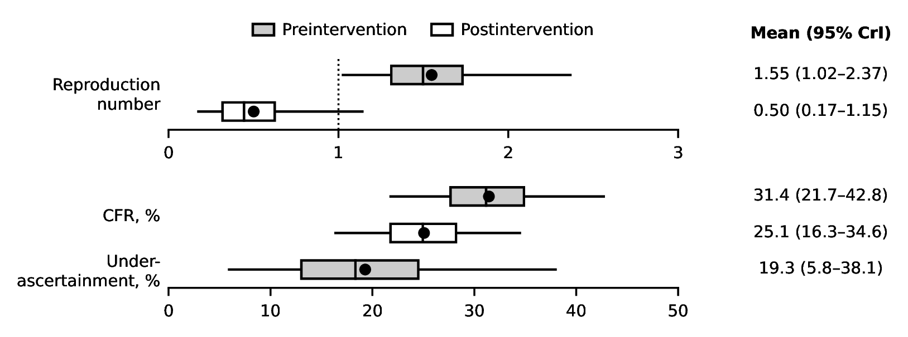

# Estimated transmissibility and case fatality rate of Bundibugyo virus, Uganda, 2007

Supporting materials for de Padua B, Akhmetzhanov AR. "Estimated transmissibility and case fatality rate of Bundibugyo virus, Uganda, 2007" *Emerging Infectious Diseases* 2026 Oct (doi:[10.3201/eid3210.261175](https://doi.org/10.3201/eid3210.261175)).

  

Because the epidemiology of Bundibugyo virus remains unclear, we reanalyzed the first recognized outbreak, Uganda, 2007. Adjusting for case under-ascertainment and the effect of control measures, we estimated the reproduction number (1.55, falling below one after the intervention) and case-fatality ratio (31%, declining to 25%). The under-ascertainment rate was 15%.

### Main script

* [20260818 Bundibugyo 2007 outbreak.py](src/20260818%20Bundibugyo%202007%20outbreak.py) is a Python script organized in cells (`# %%`, runs in VS Code or Jupyter). It loads the weekly counts, prepares the data for every model variation, stages and launches the Stan fits on our computation server, and then processes the posterior draws to produce the figure of the main text, Appendix Figures 1–6 and Appendix Tables 1–5.

### Stan models

All 41 models used in the paper are collected in [src/stan_src](src/stan_src). Their file names encode the temporal resolution (daily or weekly), the incubation period distribution (gamma, Weibull, lognormal or triangular), the type of intervention (step, ramp, or partial ascertainment of cases and deaths), the model structure (semi-mechanistic with uniform or Dirichlet within-week allocation, or fully mechanistic with VTM or CV process noise), and the case-fatality likelihood (quasi-binomial or its gamma approximation). The baseline model is [Rt_Bundibugyo-daily_gamma_step_semi_mechanistic_uniform_quasi-Binomial.stan](src/stan_src/Rt_Bundibugyo-daily_gamma_step_semi_mechanistic_uniform_quasi-Binomial.stan). Every variant, its data inputs and the sampler settings are described in [src/README.md](src/README.md).

### Additional details

* The folder **data** contains the weekly counts of fatal and non-fatal cases digitized from Figure 2 of Wamala et al. (*Emerg Infect Dis* 2010;16:1087–92), both as extracted and as read by the script. The columns are described in [data/README.md](data/README.md).
* The folder **figures** contains the figures produced by the script (PDF and PNG). [figures/README.md](figures/README.md) gives, for each file, its number in the paper and its caption.
* The Stan output of all 147 fits (posterior draws of 5 chains per model, sampler logs, and the data and initial values of each fit), together with the summary tables behind Appendix Tables 1–4, is available in a shared [Dropbox folder](https://www.dropbox.com/scl/fo/fx43wb8v52uqlrb46p91d/AB2Vy0LIhPt8bENJw3TSqjU?rlkey=f6rz1fi4sav3zmy04izmxeevp&st=wtua2hy8&dl=0).

---------
**Thank you for your interest to our work!** 

The script was written in Python (cmdstanpy, ArviZ, matplotlib) with CmdStan used for Bayesian simulations.

**Words of caution**: We note that the code is not supposed to work out of box, because the links used in the script are user-specific and the credentials of our computation server, where all Stan models were fitted, are hidden. The posterior draws are not included in this repository because of their size, but the complete Stan output is available in the Dropbox folder linked above. Our main intent was to show the relevance of the methods used in our paper. We are grateful for your understanding in advance.
